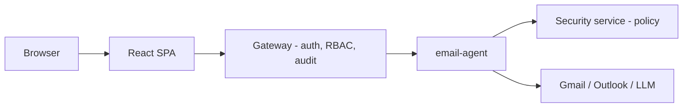

# Agora

A self-hosted platform for running AI agents behind a single authenticated
gateway, with capability-based isolation between what an agent can *decide*
and what it's actually allowed to *do*. The email agent is the platform's
current reference implementation.

## Why Agora?

Giving an LLM access to your inbox and letting it act — reply, forward,
label, archive — means trusting a language model with real consequences.
Most "AI email assistant" projects either don't let the model act at all, or
let it act with no meaningful gate in between. Agora exists to make that gate
real: every tool call an agent makes is authorized against an explicit policy
before it executes, human approval is required for anything hard to undo, and
every action is recorded in a tamper-evident audit log. The platform layer
(auth, RBAC, audit, the agent contract) is deliberately agent-agnostic, so the
email agent is a proof of the model, not the whole point of it.

## What it provides today

Everything below is implemented and exercised by the shipped `email-agent`,
not aspirational:

- **Self-hosted agent platform** — a Spring Boot gateway in front of one or
  more agent instances, with a documented contract (`docs/AGENTS.md`) another
  agent type could implement. One agent type ships today.
- **Email agent reference implementation** — Gmail and Outlook integration,
  LangGraph-based triage/drafting workflow, deterministic category rules
  with an LLM fallback.
- **Human-in-the-loop approvals** — sends, forwards, and other hard-to-undo
  actions pause for review; an edited approval is re-authorized before it
  executes, not just re-displayed.
- **Capability-based tool authorization** — every tool call is checked
  against an allow/hitl/deny policy by a separate service before it runs.
- **Prompt-injection defenses** — inbound sanitization, an outbound content
  audit before send, and an adversarial regression suite that fails CI on
  any successful attack. Mitigated, not eliminated — see
  `docs/SECURITY_MODEL.md`.
- **RBAC** — a platform-role axis and a per-instance-role axis, both
  enforced server-side.
- **Multi-instance tenant isolation** — separate mailboxes/instances with
  isolated state, backed by PostgreSQL row-level security on the
  application's own tables.
- **Tamper-evident audit log** — SHA-256 hash-chained, independently
  verifiable (`GET /audit/verify`).
- **Local-first or bring-your-own LLM** — runs on a local Ollama model by
  default; a LiteLLM proxy profile exists for pointing at an
  enterprise-provided model endpoint instead. See `docs/DEPLOYMENT.md`.
- **Observability** — Prometheus metrics, a starter Grafana dashboard.

## Architecture



The gateway is the only path into an agent — nothing is reachable directly
from a browser or the internet. Full request flow, agent execution flow, and
trust boundaries: [`docs/ARCHITECTURE.md`](docs/ARCHITECTURE.md).

## Security model

```
Authentication → Platform RBAC → Instance authorization
→ Gateway trust boundary → Capability authorization → HITL where required
→ Outbound safeguards
```

Every layer above is enforced server-side and independently — a gap in one
doesn't remove the others. Full detail, including what this model does
**not** claim to solve: [`docs/SECURITY_MODEL.md`](docs/SECURITY_MODEL.md).

## Quick start

Requires Docker and Docker Compose v2. First run builds four images and
pulls a local LLM model — budget several minutes for that, not five.

```bash
git clone <repo-url> agora && cd agora/infra
cp .env.example .env   # fill in the required values — see docs/DEPLOYMENT.md
docker compose -f docker-compose.yml -f docker-compose.override.local.yml up --build
```

Open `http://localhost:5173` once containers report healthy, and log in with
the owner credentials you set in `.env`. This mode is dry-run by default —
no real email is ever sent. Full setup, production deployment, and LLM
configuration: [`docs/DEPLOYMENT.md`](docs/DEPLOYMENT.md).

## Screenshots

_Not yet added._ The most representative views, once captured from a running
instance, will be: the login page, the workspace inbox/dashboard, the
validation queue (a pending draft awaiting human approval — Agora's most
distinctive screen), the audit log, and the permissions/roles page.

## Documentation

| Doc | Covers |
|---|---|
| [`docs/ARCHITECTURE.md`](docs/ARCHITECTURE.md) | Services, request flow, agent execution flow, trust boundaries, tenancy |
| [`docs/SECURITY_MODEL.md`](docs/SECURITY_MODEL.md) | Threat model, auth, authorization, capability isolation, HITL, prompt-injection defenses, limitations |
| [`docs/DEPLOYMENT.md`](docs/DEPLOYMENT.md) | Local dev, production, LLM configuration, backup/restore, observability |
| [`docs/AGENTS.md`](docs/AGENTS.md) | The agent contract — what a service must implement to register as an agent type |
| [`docs/INCIDENT_RESPONSE.md`](docs/INCIDENT_RESPONSE.md) | Incident classes, detection sources, response steps |
| [`docs/compliance/`](docs/compliance/) | Data retention policy, GDPR data processing inventory |
| [`services/email-agent/docs/`](services/email-agent/docs/) | Capability/tool reference, category automation, mail-provider mapping, token encryption, Gmail push setup |

## Project status

Actively developed, not a finished product. The gateway/RBAC/audit core and
the Gmail path of the email agent are the most exercised parts of the
system. Known experimental or less-verified areas, stated plainly rather
than glossed over:

- **Outlook support** shares the same authorization path as Gmail but has
  not been verified against a live mailbox.
- **The agent contract** (`docs/AGENTS.md`) is implemented and tested by
  the one shipped agent type; no second, independent agent type has been
  built against it yet.
- **The frontend has no automated test suite.**
- No formal third-party security audit has been performed.

## Contributing

See [`CONTRIBUTING.md`](CONTRIBUTING.md) for workflow, branch/commit
conventions, and local setup for each service.

## License

[Apache License 2.0](LICENSE).
