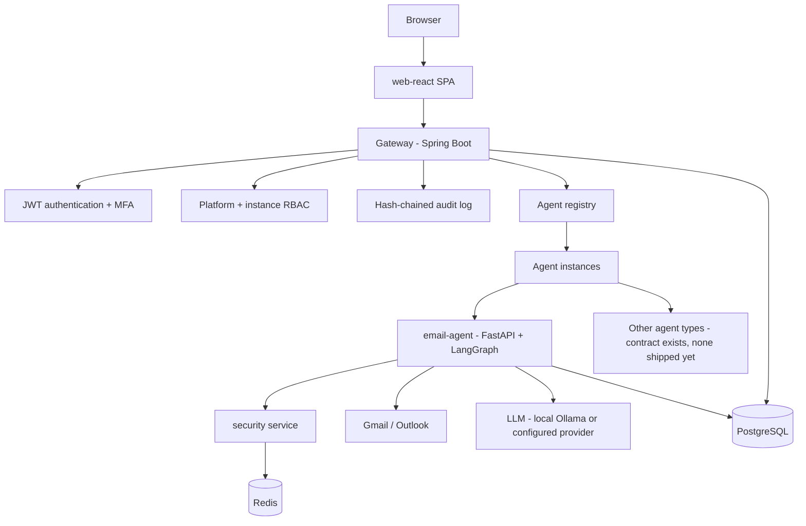
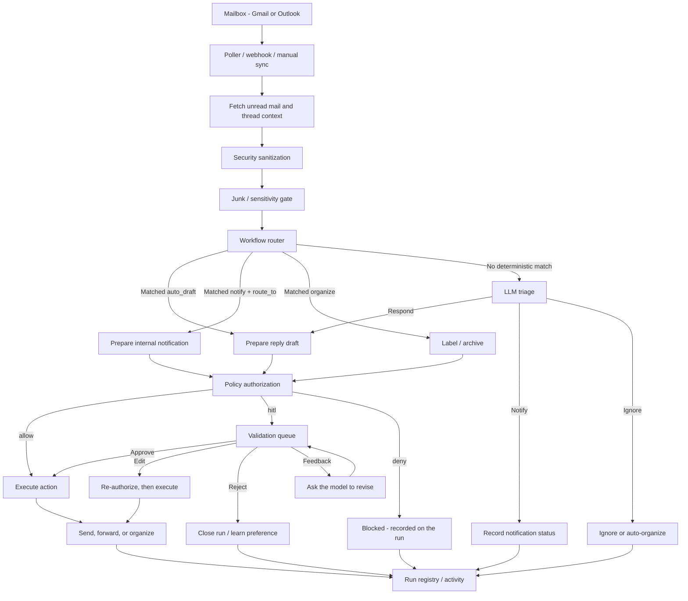

# Architecture

Agora is a self-hosted platform for running AI agents behind a single,
authenticated gateway, with capability-based isolation between what an agent
can *decide* and what it's actually allowed to *do*. This document is the
authoritative technical description: keep it in step with the code. Two
views: the platform as a whole, and the one shipped agent's processing flow.

## Services

| Service | Language/framework | Role |
|---|---|---|
| `web-react` | React 19, Vite | The SPA. Talks only to the gateway, never directly to an agent or the security service. |
| `gateway` | Java 21, Spring Boot | Authentication, RBAC, audit logging, and a reverse proxy: the only path into an agent instance. |
| `email-agent` | Python 3.11, FastAPI, LangGraph | The one shipped agent type: Gmail/Outlook triage, drafting, and inbox automation. |
| `security` | Python 3.11, FastAPI | Inbound content sanitization and outbound tool-call authorization, called by `email-agent` over HTTP. |
| `platform-core` | Python library, not a service | Tenancy, storage, cost-accounting, and notification primitives an agent type imports rather than reimplements. See `docs/AGENTS.md`. |

Supporting infrastructure: PostgreSQL (agent run state, gateway users/audit,
row-level tenant isolation, see `docs/SECURITY_MODEL.md`), Redis (shared
cache, rate limiting, the dead-letter queue), Ollama (local-first LLM
inference) or an external LLM provider, Prometheus + Grafana (metrics),
and Traefik (TLS-terminating ingress, production deployment only, see
`docs/DEPLOYMENT.md`).

## Request flow

A user reaches the platform through the web UI. Every request goes through
the gateway: it authenticates, authorizes by role, audits, and only then
proxies to an agent instance. An agent is never exposed directly to a
browser or to the internet.

Why the gateway is a single choke point rather than each service handling
its own auth: it's the only place JWT verification, MFA, platform-role and
instance-role checks, and audit logging need to be implemented and reviewed.
An agent type only has to trust three headers (`X-Agora-User`,
`X-Agora-Agent-Instance`, `X-Agora-Instance-Role`); see `docs/AGENTS.md` §3.
It never re-implements authentication.

## Agent execution flow

Within `email-agent`, deterministic workflow rules are checked before the
model runs, so known cases are handled predictably and the LLM only decides
what the rules didn't. Security sanitization runs before any agent reasoning
sees the mail. Sending and forwarding are approval-gated.

Notes:

- The junk gate is judged on the message and evaluated before any category
  claim; a category may only claim automated mail via `accepts_automated`.
- Both routers honor the security verdict: an injection forces `notify`
  rather than a silent `respond`.
- Approval policy is additive: a category can escalate a tool's default
  `allow` to `hitl` and narrow recipients, never the reverse.
- Edited approvals are re-authorized before execution, not just re-displayed.

## Why the security service is separate

`security` is a distinct process, not a library `email-agent` imports,
called over HTTP for two operations: sanitizing inbound content before the
LLM sees it, and authorizing every tool call before it executes. Keeping it
separate means the capability policy (`services/security/policy.yaml`) is
enforced by a process the agent's own code can't silently route around:
even a compromised or buggy prompt path in `email-agent` still has to make
an HTTP call that gets independently evaluated, not an in-process function
call it could patch or skip. See `docs/SECURITY_MODEL.md` for the full
authorization chain.

## Trust boundaries

1. **Browser ↔ gateway**: the only boundary a browser crosses. TLS in
   production (Traefik); JWT + refresh cookie for session state.
2. **Gateway ↔ agent**: an internal network boundary. The agent verifies a
   shared secret on every request (except `/health`/`/metrics`) and trusts
   the gateway-stamped identity headers; it never re-authenticates the
   original user.
3. **email-agent ↔ security**: an internal network boundary. `email-agent`
   cannot execute a tool call without a decision from `security`'s
   `/authorize`; a `security` outage fails closed (blocks the action), not
   open.
4. **email-agent ↔ external services**: Gmail/Outlook APIs and the
   configured LLM endpoint. Outbound sends carry one more independent check
   (`AGENT_OUTBOUND_ALLOWLIST`) beyond whatever `security` already decided.

## Tenancy

Every agent instance is isolated state, not just a UI grouping. The gateway
resolves which instance a request targets and stamps `X-Agora-Agent-Instance`
on the proxied request; `email-agent` scopes every read and write (run
records, memory, OAuth tokens, cost entries, categories) to that instance
id and to the requesting user. PostgreSQL row-level security policies bind
business-table queries to the tenant/instance pair as a second, database-
level enforcement layer beneath the application-level scoping. See
`docs/SECURITY_MODEL.md` for what's covered by RLS versus application-level
checks only.

## Where authentication and authorization happen

- **Authentication** (who are you): the gateway only. JWT issuance, refresh,
  and MFA all live in `services/gateway/.../auth/`.
- **Platform authorization** (what role do you hold globally): Spring
  Security URL matchers in the gateway, checked before a request reaches the
  proxy.
- **Instance authorization** (what can you do on *this* agent instance): the
  gateway's proxy layer, resolving creator ownership, explicit grants, or an
  instance's configured allowed roles.
- **Capability authorization** (can this specific tool call happen): the
  `security` service's `/authorize`, called by `email-agent` before every
  tool execution.

Full detail on all four layers, plus what each one does and doesn't defend
against, is in `docs/SECURITY_MODEL.md`.
